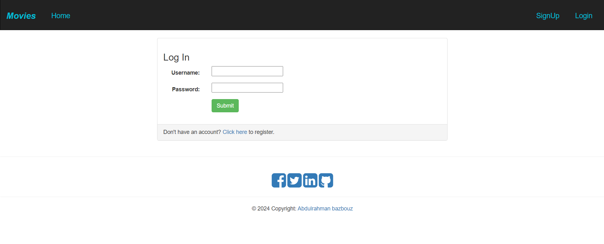

# Movie Recommender System

## Description
The Movie Recommender System is a web application designed to provide personalized movie recommendations to users. Utilizing Django as the web framework and machine learning algorithms, this application ensures accurate recommendations based on user preferences and viewing history.

## Features
- **User Authentication**: Users can register, log in, and log out.
- **Movie Recommendations**: Personalized movie recommendations based on user ratings and preferences.
- **Movie Search**: Search functionality to find movies by title.
- **Admin Interface**: Admin panel to manage movies and user accounts.

## Technologies Used
- **Languages**:
  - Python
  - HTML/CSS
  - JavaScript
- **Libraries**:
  - Django
  - pandas
  - numpy
  - scikit-learn
  - scipy

## Setup and Installation

### Prerequisites
- Python 3.x
- pip (Python package installer)

### Installation Steps
1. **Clone the Repository**:
    ```bash
    git clone https://github.com/<your-username>/Movie-Recommender-System.git
    ```
2. **Navigate to the Project Directory**:
    ```bash
    cd Movie-Recommender-System-master
    ```
3. **Create and Activate Virtual Environment**:
    ```bash
    python -m venv env
    source env/bin/activate  # On Windows use `env\Scripts\activate`
    ```
4. **Install Required Packages**:
    ```bash
    pip install -r requirements.txt
    ```
5. **Navigate to the Source Directory**:
    ```bash
    cd src
    ```
6. **Apply Migrations**:
    ```bash
    python manage.py migrate
    ```
7. **Run the Development Server**:
    ```bash
    python manage.py runserver
    ```

## Usage
After completing the installation steps, access the application at [http://127.0.0.1:8000/](http://127.0.0.1:8000/).

### Screenshots

#### Login Page

*The Login Page allows users to log in with their username and password.*

#### Main Page

*The Main Page displays a list of movies available for rating. Users can search for specific movies using the search bar.*

#### Recommendation Page

*The Recommendation Page shows personalized movie recommendations based on user ratings and preferences.*

#### Rating Page

*The Rating Page allows users to rate a specific movie. The URL includes the movie ID, e.g., [http://127.0.0.1:8000/1/](http://127.0.0.1:8000/1/).*

#### Sign Up Page

*The Sign Up Page allows new users to create an account by providing a username, email address, and password.*

## Contributing
To contribute to the Movie Recommender System, follow these steps:

1. **Fork the Repository**: Create a copy of the repository on your GitHub account.
2. **Create a New Branch**: Make a new branch for your feature or bugfix.
    ```bash
    git checkout -b feature-name
    ```
3. **Make Changes**: Implement your feature or bugfix.
4. **Commit Changes**: Commit your changes with a descriptive message.
    ```bash
    git commit -m "Description of changes"
    ```
5. **Push Changes**: Push your changes to your forked repository.
    ```bash
    git push origin feature-name
    ```
6. **Submit a Pull Request**: Go to the original repository and create a pull request with your changes.


### Code of Conduct
All contributors are expected to adhere to the project's Code of Conduct, which promotes a welcoming and inclusive environment.

## License
This project is licensed under the MIT License. See the `LICENSE` file for details.

